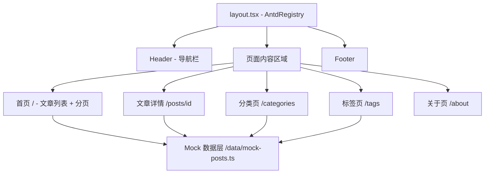

## 产品概述

一个基于 Next.js + Ant Design 的简单博客应用，使用本地 Mock 数据驱动，无需后端服务和数据库。

## 核心功能

- **首页**: 文章列表展示，支持分页与分类筛选
- **文章详情页**: 展示文章标题、内容、作者、发布日期、标签
- **分类页**: 按分类浏览文章列表
- **标签页**: 按标签浏览文章列表
- **关于页**: 博客介绍信息
- **全局布局**: 顶部导航栏 + 底部 Footer，响应式适配

## 技术栈

- **框架**: Next.js 14 (App Router)
- **语言**: TypeScript
- **UI 组件库**: Ant Design 5.x
- **数据源**: 本地 Mock 数据 (TypeScript 文件)
- **包管理器**: pnpm
- **样式方案**: Ant Design 主题 + CSS Modules (少量自定义样式)

## 实现方案

### 架构模式

采用 Next.js 14 App Router 架构，利用文件系统路由实现页面导航。数据层使用本地 Mock 数据文件模拟 API 响应，后续可无缝替换为真实 API。

### 关键技术决策

- **Ant Design 5.x**: 使用 CSS-in-JS 方案，通过 ConfigProvider 配置全局主题，无需额外引入 less/css 文件
- **Ant Design Next.js 兼容**: Ant Design 使用浏览器 API，所有使用 antd 组件的页面组件需标记 `'use client'`
- **Mock 数据结构**: 使用 TypeScript 接口定义数据模型，Mock 数据以静态 TS 对象形式存储，方便维护和扩展
- **分页实现**: 使用 URL search params (useSearchParams) 管理分页状态，支持 SSR 友好的页面导航

### 性能与可靠性

- 使用 Next.js 静态生成 (SSG) 或服务端渲染 (SSR) 提升首屏性能
- Ant Design 按需加载，通过动态导入减少客户端包体积
- Mock 数据作为模块直接引入，零网络开销

### 实现注意事项

- `next.config.js` 中需配置 `transpilePackages: ['antd', '@ant-design/icons']` 确保 antd 在 Next.js 中正常工作
- 根布局 (layout.tsx) 中包裹 AntdRegistry (来自 @ant-design/nextjs-registry) 解决 SSR 样式闪烁问题
- 避免在 Server Component 中直接使用 antd 组件，需要时拆分为 Client Component

### 架构设计



### 目录结构

```
NEXT-PROJECT/
├── app/
│   ├── layout.tsx              # [NEW] 根布局，包裹 AntdRegistry、Header、Footer
│   ├── page.tsx                # [NEW] 首页，文章列表 + 分页 + 分类筛选
│   ├── globals.css             # [NEW] 全局样式重置
│   ├── posts/
│   │   └── [id]/
│   │       └── page.tsx        # [NEW] 文章详情页
│   ├── categories/
│   │   └── page.tsx            # [NEW] 分类页
│   ├── tags/
│   │   └── page.tsx            # [NEW] 标签页
│   └── about/
│       └── page.tsx            # [NEW] 关于页
├── components/
│   ├── Header.tsx              # [NEW] 顶部导航栏 (Client Component)
│   ├── Footer.tsx              # [NEW] 底部信息栏 (Client Component)
│   ├── PostCard.tsx            # [NEW] 文章卡片组件 (Client Component)
│   └── Sidebar.tsx             # [NEW] 侧边栏：分类/标签/关于信息 (Client Component)
├── data/
│   ├── mock-posts.ts           # [NEW] Mock 文章数据及类型定义
│   └── site-config.ts          # [NEW] 站点配置（标题、描述、作者信息）
├── lib/
│   └── utils.ts                # [NEW] 工具函数（日期格式化、截取摘要等）
├── public/
│   └── avatar.jpg              # [NEW] 默认头像占位图
├── next.config.js              # [NEW] Next.js 配置
├── tsconfig.json               # [NEW] TypeScript 配置
├── package.json                # [NEW] 项目依赖
└── README.md                   # [MODIFY] 更新项目说明
```

## 设计风格

采用简约现代的博客设计风格，以内容阅读体验为核心。使用 Ant Design 5.x 组件库，通过 ConfigProvider 自定义主题色，打造清新、专注的阅读氛围。

### 页面规划

#### 1. 首页 (文章列表)

- **顶部导航栏**: 固定定位，包含博客 Logo/标题、导航链接（首页、分类、标签、关于），响应式收缩为汉堡菜单
- **内容区 (两栏布局)**: 左侧主区域为文章列表，右侧为侧边栏（分类列表、标签云、博客简介）
- **文章卡片**: 使用 Ant Design Card 组件，展示封面图、标题、摘要、发布日期、分类标签，hover 时轻微上浮
- **分页**: 使用 Ant Design Pagination 组件，居底展示

#### 2. 文章详情页

- **文章头部**: 标题（大号字）、作者信息（头像+名称）、发布日期、分类和标签
- **文章正文**: 使用 Typography 组件渲染 Markdown 内容，合适行高与段落间距
- **底部操作**: 返回列表按钮

#### 3. 分类页

- **分类卡片网格**: 使用 Ant Design Card Grid 展示所有分类，每个分类显示名称和文章数量

#### 4. 标签页

- **标签云**: 使用 Ant Design Tag 组件以云状布局展示所有标签，可点击筛选

#### 5. 关于页

- **个人简介卡片**: 头像、姓名、简介文字
- **技术栈展示**: 使用 Ant Design Tag 列出技术标签

#### 6. 全局 Footer

- 版权信息、社交媒体链接